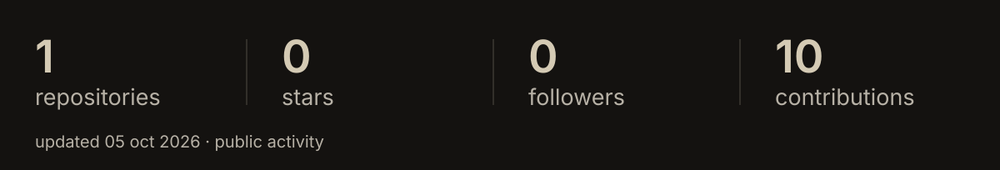
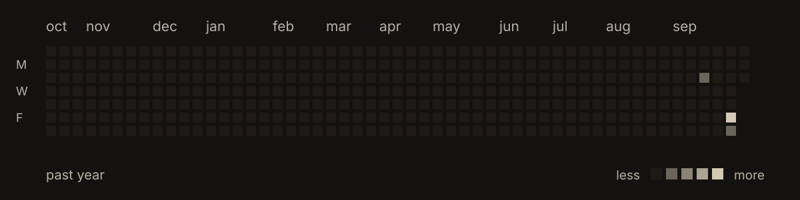

  <picture>
    <source media="(max-width: 600px)" srcset="./assets/banner-mobile.svg">
    
  </picture>

 

  i use AI to build whatever i'm into at the time. 
  usually on Linux, probably in a terminal.

  <a href="https://github.com/riz3y0?tab=repositories">explore my projects ↗</a>

 

## github

<picture>
  <source media="(max-width: 600px)" srcset="./assets/github-status-mobile.svg">
  
</picture>

## activity

<picture>
  <source media="(max-width: 600px)" srcset="./assets/github-activity-mobile.svg">
  
</picture>

Public GitHub data, refreshed every six hours. The phone layout shows the most recent six months.

## languages

| | |
| :--- | :--- |
| **systems** | C · C++ · Rust · Zig · Assembly · D · Odin · Nim |
| **browser** | JavaScript · TypeScript · HTML · CSS · Sass |
| **backend** | Python · Go · PHP · Ruby · Java · C# · Kotlin · Elixir |
| **data** | SQL |
